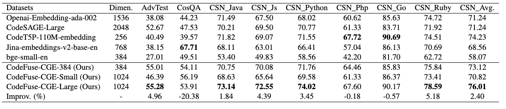

## CodeFuse-CGE
<p align="center">
    
<p>

In this project, we introduce CodeFuse-CGE(Code General Embedding), which is distinguish on text2code task for it's powerful ability of capturing the semantic relationship between text and code.  
This model has the following notable features:  
● Instruction-tuning is enabled for both query and code snippet sides.  
● The model obtains sentence-level and code-level representations through a layer of cross-attention computation module.   
● The model has a smaller dimensional size without significant degradation in performance.

CodeFuse-CGE-Large Model Configuration  
huggingface：[codefuse-ai/CodeFuse-CGE-Large](https://huggingface.co/codefuse-ai/CodeFuse-CGE-Large)   
Base Model: CodeQwen1.5-7B-Chat  
Model Size: 7B  
Embedding Dimension: 1024  
Hidden Layers: 32  

Requirements  
```
flash_attn==2.4.2
torch==2.1.0
accelerate==0.28.0
transformers==4.39.2 
vllm=0.5.3
```


CodeFuse-CGE-Small Model Configuration  
huggingface：[codefuse-ai/CodeFuse-CGE-Small](https://huggingface.co/codefuse-ai/CodeFuse-CGE-Small)    
Base Model: Phi-3.5-mini-instruct  
Model Size: 3.8B  
Embedding Dimension: 1024  
Hidden Layers: 32  

Requirements  
```
flash_attn==2.4.2
torch==2.1.0
accelerate==0.28.0
transformers>=4.43.0
```


## Benchmark the Performance
We use MRR metric to evaluate the ability on text2code retrieval tasks: AdvTest, CosQA, CSN  



## How to Use
### Transformers
```
from transformers import AutoTokenizer, AutoModel

model_name_or_path = "CodeFuse-CGE-Large"
model = AutoModel.from_pretrained(model_name_or_path, trust_remote_code=True)
tokenizer = AutoTokenizer.from_pretrained(model_name_or_path, trust_remote_code=True, truncation_side='right', padding_side='right')

if torch.cuda.is_available():
    device = 'cuda'
else:
    device = 'cpu'
model.to(device)

prefix_dict =  {'python':{'query':'Retrieve the Python code that solves the following query:', 'passage':'Python code:'},
                'java':{'query':'Retrieve the Java code that solves the following query:', 'passage':'Java code:'},
                'go':{'query':'Retrieve the Go code that solves the following query:', 'passage':'Go code:'},
                'c++':{'query':'Retrieve the C++ code that solves the following query:', 'passage':'C++ code:'},
                'javascript':{'query':'Retrieve the Javascript code that solves the following query:', 'passage':'Javascript code:'},
                'php':{'query':'Retrieve the PHP code that solves the following query:', 'passage':'PHP code:'},
                'ruby':{'query':'Retrieve the Ruby code that solves the following query:', 'passage':'Ruby code:'},
                'default':{'query':'Retrieve the code that solves the following query:', 'passage':'Code:'}
                }

text = ["Writes a Boolean to the stream.",
        "def writeBoolean(self, n): t = TYPE_BOOL_TRUE if n is False: t = TYPE_BOOL_FALSE self.stream.write(t)"]
text[0] += prefix_dict['python']['query']
text[1] += prefix_dict['python']['passage']
embed = model.encode(tokenizer, text)
score = embed[0] @ embed[1].T
print("score", score)
```

### Vllm
We have also adapted Vllm to reduce latency during deployment.
```
from vllm import ModelRegistry
from utils.vllm_codefuse_cge_large import CodeFuse_CGE_Large
from vllm.model_executor.models import ModelRegistry
from vllm import LLM

def always_true_is_embedding_model(model_arch: str) -> bool:
    return True
ModelRegistry.is_embedding_model = always_true_is_embedding_model
ModelRegistry.register_model("CodeFuse_CGE_Large", CodeFuse_CGE_Large)


model_name_or_path = "CodeFuse-CGE-Large"
model = LLM(model=model_name_or_path, trust_remote_code=True, enforce_eager=True, enable_chunked_prefill=False)
prefix_dict =  {'python':{'query':'Retrieve the Python code that solves the following query:', 'passage':'Python code:'},
                'java':{'query':'Retrieve the Java code that solves the following query:', 'passage':'Java code:'},
                'go':{'query':'Retrieve the Go code that solves the following query:', 'passage':'Go code:'},
                'c++':{'query':'Retrieve the C++ code that solves the following query:', 'passage':'C++ code:'},
                'javascript':{'query':'Retrieve the Javascript code that solves the following query:', 'passage':'Javascript code:'},
                'php':{'query':'Retrieve the PHP code that solves the following query:', 'passage':'PHP code:'},
                'ruby':{'query':'Retrieve the Ruby code that solves the following query:', 'passage':'Ruby code:'},
                'default':{'query':'Retrieve the code that solves the following query:', 'passage':'Code:'}
                }

text = ["Return the best fit based on rsquared",
        "def find_best_rsquared ( list_of_fits ) : res = sorted ( list_of_fits , key = lambda x : x . rsquared ) return res [ - 1 ]"]
text[0] += prefix_dict['python']['query']
text[1] += prefix_dict['python']['passage']
embed_0 = model.encode([text[0]])[0].outputs.embedding
embed_1 = model.encode([text[1]])[0].outputs.embedding
```
Note:  
1. After adapting Vllm, the model's input can only have a batch size of 1; otherwise, it will result in an array overflow error.  
2. Only the CodeFuse-CGE-Large model has been adapted, and support for the CodeFuse-CGE-Small model will be available soon.


## Acknowledgement
Thanks to the authors of open-sourced datasets, including CSN, Adv, CoSQA.

